# OmniTune: Unified Efficient Fine-Tuning of 100+ LLMs & VLMs 🚀✨

<div align="center">

<p align="center">
  
</p>

<a href="https://github.com/ishandutta2007/Awesome-Awesome-Awesome"></a><a href="https://discord.gg/jc4xtF58Ve"></a>
[](LICENSE)
[](https://www.python.org/)
[](https://pypi.org/project/omnitune/)
[](https://omnitune.readthedocs.io/en/latest/)
<a href="https://github.com/ishandutta2007"></a>

**OmniTune** is a powerful, production-ready framework for fine-tuning, evaluating, and deploying frontier Large Language Models (LLMs) and Multimodal Vision-Language Models (VLMs). 🌐⚡

[✨ Key Features](#key-features) •
[📦 Quick Installation](#installation) •
[🖥️ Web UI (OmniTune-Board)](#omnitune-board-web-ui) •
[⚡ CLI Quickstart](#command-line-interface-cli) •
[🧠 Supported Architectures](#supported-model-families) •
[📚 Documentation](#documentation)

</div>

---

## ✨ Key Features

- 🤖 **Multi-Model Support**: Fine-tune 100+ architectures including LLaMA 3/3.1/3.2, DeepSeek-V3/R1, Qwen 2.5/Qwen2-VL, Mistral/Mixtral, Gemma 2, Phi-3/4, InternLM, and multimodal variants.
- 🎯 **Efficient Fine-Tuning Algorithms**: Full parameter tuning, Freeze tuning, LoRA, QLoRA, GaLore, BAdam, DoRA, LongLoRA, and PiSSA.
- 🔄 **Diverse Training Paradigms**:
  - Supervised Fine-Tuning (SFT) 📝
  - Direct Preference Optimization (DPO) ⚖️
  - Reward Modeling (RM) 🏆
  - Proximal Policy Optimization (PPO) 📈
  - Odds Ratio Preference Optimization (ORPO) 🔀
  - Kahneman-Tversky Optimization (KTO) 🧠
- 🚀 **High-Performance Acceleration**: DeepSpeed (ZeRO-2, ZeRO-3, Offload), PyTorch FSDP2, FSDPTurbo, FlashAttention-2, Liger Kernel, and Ulysses Sequence Parallelism.
- 🎨 **Zero-Code Web Interface**: Launch **OmniTune-Board** powered by Gradio to configure hyperparameters, monitor loss curves, and evaluate checkpoints interactively.
- ⚡ **Production Inference & Serving**: Export merged HuggingFace weights, quantize models (AWQ, GPTQ), or serve high-throughput APIs powered by vLLM.

---

## 📦 Installation

### 📋 Prerequisites
- Python >= 3.11 🐍
- PyTorch >= 2.4.0 🔥
- CUDA >= 12.0 (for NVIDIA GPUs) or ROCm / NPU CANN 💻

### 🛠️ Install from Source
```bash
git clone https://github.com/ishandutta2007/OmniTune.git
cd OmniTune
pip install -e ".[torch,metrics]"
```

### ⚡ Optional Optimizers & Kernels
```bash
# FlashAttention-2
pip install flash-attn --no-build-isolation

# DeepSpeed acceleration
pip install deepspeed

# High-throughput vLLM engine
pip install vllm
```

---

## 🖥️ OmniTune-Board Web UI

Launch the zero-code browser dashboard: 🚀

```bash
omnitune webui
```
Or use the short command:
```bash
ot webui
```

Access the interface in your browser at `http://localhost:7860`. From the web dashboard, you can:
- 📑 Select models, templates, and datasets.
- ⚙️ Configure LoRA ranks, learning rate schedules, and gradient accumulation.
- 📊 Visualize real-time training loss and evaluation metrics.
- 💬 Chat with fine-tuned checkpoints directly inside the playground.
- 💾 Merge adapter weights and export standalone checkpoints.

---

## ⚡ Command-Line Interface (CLI)

OmniTune provides both single-line execution commands and clean YAML config-based execution. 💻

### 1. 📝 Supervised Fine-Tuning (SFT) with LoRA

Run from a configuration file:
```bash
omnitune train examples/train_lora/llama3_lora_sft.yaml
```

Or via direct command-line arguments:
```bash
omnitune train \
    --stage sft \
    --do_train \
    --model_name_or_path meta-llama/Meta-Llama-3-8B-Instruct \
    --dataset alpaca_en_demo \
    --dataset_dir data \
    --template llama3 \
    --finetuning_type lora \
    --lora_target all \
    --output_dir saves/llama3-8b/lora/sft \
    --overwrite_output_dir \
    --cutoff_len 2048 \
    --learning_rate 1e-4 \
    --num_train_epochs 3.0 \
    --per_device_train_batch_size 2 \
    --gradient_accumulation_steps 8 \
    --lr_scheduler_type cosine \
    --logging_steps 10 \
    --save_steps 100 \
    --warmup_ratio 0.1 \
    --fp16
```

### 2. ⚖️ Direct Preference Optimization (DPO)

```bash
omnitune train \
    --stage dpo \
    --do_train \
    --model_name_or_path meta-llama/Meta-Llama-3-8B-Instruct \
    --adapter_name_or_path saves/llama3-8b/lora/sft \
    --dataset dpo_en_demo \
    --dataset_dir data \
    --template llama3 \
    --finetuning_type lora \
    --output_dir saves/llama3-8b/lora/dpo \
    --cutoff_len 2048 \
    --learning_rate 5e-6 \
    --num_train_epochs 2.0 \
    --dpo_beta 0.1 \
    --fp16
```

### 3. 💬 Interactive Chat / Testing
```bash
omnitune chat \
    --model_name_or_path meta-llama/Meta-Llama-3-8B-Instruct \
    --adapter_name_or_path saves/llama3-8b/lora/sft \
    --template llama3
```

### 4. 🌐 OpenAI-Compatible API Server
Deploy a production REST API compatible with the OpenAI specification:
```bash
omnitune api \
    --model_name_or_path meta-llama/Meta-Llama-3-8B-Instruct \
    --adapter_name_or_path saves/llama3-8b/lora/sft \
    --template llama3 \
    --api_port 8000
```

### 5. 💾 Export & Merge LoRA Weights
Export standalone model weights for fast inference engines (vLLM, Ollama, TensorRT-LLM):
```bash
omnitune export \
    --model_name_or_path meta-llama/Meta-Llama-3-8B-Instruct \
    --adapter_name_or_path saves/llama3-8b/lora/sft \
    --template llama3 \
    --export_dir saves/llama3-8b-merged \
    --export_size 4 \
    --export_device cpu
```

---

## 🧠 Supported Model Families

| Architecture | Model Providers / Variants |
| :--- | :--- |
| **LLaMA** 🦙 | LLaMA, LLaMA 2, LLaMA 3, LLaMA 3.1, LLaMA 3.2, LLaMA 3.3 |
| **Qwen** 🌐 | Qwen, Qwen 1.5, Qwen 2, Qwen 2.5, Qwen2-VL, Qwen2.5-Coder |
| **DeepSeek** 🐳 | DeepSeek-LLM, DeepSeek-Coder, DeepSeek-V2, DeepSeek-V3, DeepSeek-R1 |
| **Mistral / Mixtral** 🌪️ | Mistral 7B, Mixtral 8x7B, Mixtral 8x22B, Mistral Nemo |
| **Gemma** 💎 | Gemma 2B/7B, Gemma 2 2B/9B/27B |
| **Phi** 🔬 | Phi-1.5, Phi-2, Phi-3, Phi-3.5, Phi-4 |
| **InternLM** 💡 | InternLM, InternLM 2, InternLM 2.5, InternVL, InternVL 2 |
| **Others** 🧩 | Baichuan, ChatGLM, Falcon, Granite, Orion, TeleChat, Yi, XVERSE |

---

## 📚 Documentation

- 📖 [Getting Started Guide](docs/en/getting-started.md)
- 🖥️ [OmniTune-Board Web UI Guide](docs/en/omnitune-board-web-ui.md)
- ⚙️ [Distributed Training (FSDP, DeepSpeed)](docs/en/advanced/distributed/parallel-dp-tp-ep-sp-cp.md)
- 📋 [Hyperparameters Reference](docs/en/hyperparameters/training-argument.md)

---

## ⭐ Star History

[](https://star-history.dera.page/#ishandutta2007/OmniTune&type=date&legend=top-left)

---

## 📄 License

This repository is licensed under the [Apache 2.0 License](LICENSE). 📜
